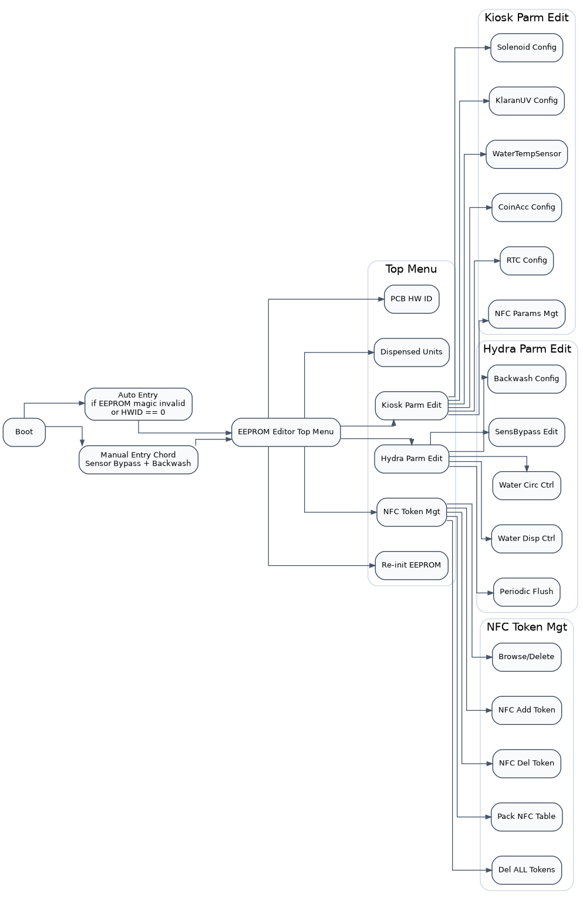
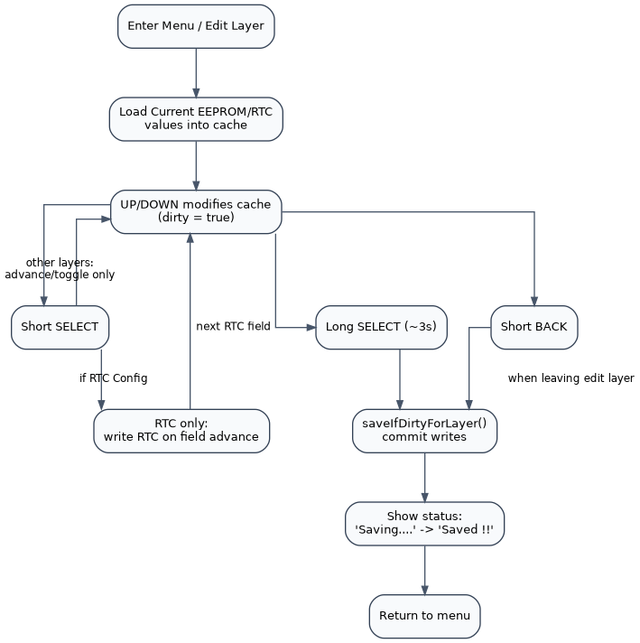

# EEPROM Editor User Manual

## 1. Overview

The EEPROM Editor is the kiosk's maintenance interface for configuring non-volatile settings and service data.

Primary use cases:

- Commissioning and HWID setup.
- Hydraulic and kiosk parameter tuning.
- NFC token table management.
- RTC date/time setting.
- Service counters inspection/reset.

The editor is a boot-time service mode and is non-returning. Exit is by reset.

---

## 2. Entry And Exit

## 2.1 How To Enter

You can enter EEPROM Editor in either way:

1. Automatic maintenance entry:
   - On boot, if EEPROM magic is invalid or HWID is `0`.
2. Manual boot chord:
   - Hold `Sensor Bypass` + `Backwash` during boot.
   - Release when prompted.

## 2.2 How To Exit

- Long `BACK` (~4s) triggers watchdog reset.
- `Re-init EEPROM` flow ends with reset.
- Editor does not return directly to runtime flow.

---

## 3. High-Level Navigation Diagram

---

## 4. Buttons In EEPROM Editor Mode

During editor mode, panel buttons are remapped:

| Editor Action | Physical Button Constant | Typical Panel Label |
|---|---|---|
| `UP` | `BTN_CONT_CIRC` | Continuous Circulation |
| `DOWN` | `BTN_WATER_INLET` | Water Inlet |
| `SELECT` | `BTN_SENSOR_BYPASS` | Sensor Bypass |
| `BACK` | `BTN_BACKWASH_CTL` | Backwash |

Press semantics:

- Short `UP/DOWN`: move cursor or change value.
- Hold `UP/DOWN`: auto-repeat starts after ~2s, then accelerates.
- Short `SELECT`: enter submenu, advance field, or toggle prompt.
- Long `SELECT` (~3s): save/confirm for current context.
- Short `BACK`: go to previous menu layer.
- Long `BACK` (~4s): reset and exit editor.

Special `BACK` behavior:

- In `RTC Config`, short `BACK` moves to previous RTC field first.
- In NFC Add/Del scan screens, short `BACK` exits immediately.

---

## 5. Save/Write Behavior Diagram

---

## 6. Display Layout (OLED)

General layout:

- Row 0: `EEPROM Edit Mode`
- Row 1: separator

Top-level menu only:

- Row 2: `HWID:...`
- Row 3: `SWID:...`

Lower-level menus:

- Row 2: current menu title
- Row 3: blank
- Menu list starts at row 4

Value presentation:

- For value-heavy layers (e.g. Backwash, Water Disp, NFC Params),
  - row 12 is cleared,
  - current value is centered on row 13.
- Row 14 is normally blank for editor layers.

Status line:

- Row 15 shows one of:
  - `   Saving....   `
  - `    Saved !!    `
  - navigation hint

RTC screen is a special layout:

- Date/time display lines are shown with a caret row indicating active editable cluster.

---

## 7. Top-Level Menu Structure

Top-level entries:

1. `PCB HW ID`
2. `Dispensed Units`
3. `Kiosk Parm Edit`
4. `Hydra Parm Edit`
5. `NFC Token Mgt`
6. `Re-init EEPROM`

### 7.1 `Kiosk Parm Edit`

- `Solenoid Config`
- `KlaranUV Config`
- `WaterTempSensor`
- `CoinAcc Config`
- `RTC Config`
- `NFC Params Mgt`

### 7.2 `Hydra Parm Edit`

- `Backwash Config`
- `SensBypass Edit`
- `Water Circ Ctrl`
- `Water Disp Ctrl`
- `Periodic Flush`

### 7.3 `NFC Token Mgt`

- `Browse/Delete`
- `NFC Add Token`
- `NFC Del Token`
- `Pack NFC Table`
- `Del ALL Tokens`

---

## 8. Menu Details

## 8.1 PCB HW ID

Purpose:

- Set stored HWID used by firmware/profile branching.

Operation:

- `UP/DOWN` change HWID.
- Long `SELECT` saves.

## 8.2 Dispensed Units

Menu entries:

- `App Disp`
- `Coin Disp`
- `NFC Token Disp`
- `Bypassed Disp`
- `TOTAL Dispensed` (read-only aggregate)

Operation:

- First four counters are editable.
- Long `SELECT` saves edited counter.

## 8.3 Kiosk Parm Edit

### 8.3.1 Solenoid Config

For each solenoid profile:

- `StartPWM`
- `HoldPWM`
- `SwOnDelay` (seconds)

### 8.3.2 KlaranUV Config

- `UV OK Delay` (`ms`)
- `UV MAX ON time` (`mins`)

### 8.3.3 WaterTempSensor

- Toggle `T1`/`T2`.

### 8.3.4 CoinAcc Config

- Toggle fitted state `YES`/`NO`.

### 8.3.5 RTC Config

Editable clusters in sequence:

- `YYYY`, `MM`, `DD`, `HH`, `MM`, `SS`

Controls:

- `UP/DOWN`: adjust active cluster (wrap behavior applied).
- Short `SELECT`: write current RTC value and move to next cluster.
- Short `BACK`: move to previous cluster; from first cluster, exit RTC screen.
- Long `SELECT`: explicit save still available.

Important behavior:

- On entry, fields are pre-populated from DS3231.
- Date/time is clamped to valid ranges before write.

### 8.3.6 NFC Params Mgt

- `NFC Init Delay` (`ms`)
- `NFC Scan Duratn` (`ms`)
- `Inter NFC Delay` (`ms`)

## 8.4 Hydra Parm Edit

### 8.4.1 Backwash Config

Parameters:

- Auto duration (`s`)
- Auto after N (`pulse`)
- Backwash dispense counter (`pulse`)
- Daily duration (`s`/`mins`)
- Daily time (`HH:MM`)
- Manual short (`s`)
- Manual long (`mins`)

### 8.4.2 SensBypass Edit

Parameters:

- Duration (`s`)
- Period (`mins`)
- Manual short (`s`)
- Manual long (`s`)

### 8.4.3 Water Circ Ctrl

Parameters:

- Auto duration (`mins`)
- Auto period (`mins`)
- Manual short (`mins`)
- Manual long (`mins`)

### 8.4.4 Water Disp Ctrl

Parameters:

- Dispense mode (`TIMED` / `PULSE`)
- Timed duration (`s`)
- Pulse count (`pulse`)
- Pre-dispense circulation/purge time and pulse values

### 8.4.5 Periodic Flush

Parameters:

- DNF repeat period (`mins`)
- DNF duration (`s`)
- Pre-flush beep delay (`s`)
- Beep period (`ms`)
- Beep on-time (`ms`)
- Beep count

## 8.5 NFC Token Mgt

### 8.5.1 Browse/Delete

Display format:

- `I ### <HASH>`
- `I` indicates table index.

Navigation:

- `UP`: decrement index
- `DOWN`: increment index
- Wrap at first/last slot.

Delete flow:

- Short `SELECT`: enter delete prompt (`YES/NO`).
- Long `SELECT` on `YES`: delete selected token.

### 8.5.2 NFC Add Token

Flow:

- Screen waits for tag.
- Two consecutive matching scans are required.
- On success, token hash is added.

### 8.5.3 NFC Del Token

Flow:

- Same two-scan validation.
- On success, matching token hash is removed.

### 8.5.4 Pack NFC Table

- Compacts and de-duplicates token table.

### 8.5.5 Del ALL Tokens

- Opens confirmation modal.
- Toggle `YES/NO`.
- Long `SELECT` executes delete-all when confirmed.

## 8.6 Re-init EEPROM

Safety flow:

1. Enter prompt.
2. Set confirmation to `YES`.
3. Hold `SELECT` for hold-time countdown.

Result:

- EEPROM reset to defaults.
- Resetting/completed messages shown.
- Device restarts.

---

## 9. Typical Service Workflows

## 9.1 Set RTC Quickly

1. `Kiosk Parm Edit` -> `RTC Config`.
2. Edit field with `UP/DOWN`.
3. Short `SELECT` to write and advance.
4. Repeat for all fields.
5. `BACK` out when done.

## 9.2 Add NFC Token

1. `NFC Token Mgt` -> `NFC Add Token`.
2. Present tag until success message.
3. `BACK` to return to token menu.

## 9.3 Tune Backwash Auto Trigger

1. `Hydra Parm Edit` -> `Backwash Config`.
2. Edit `BW AutoAfter N`.
3. Long `SELECT` to save.
4. Confirm status line shows save message.

---

## 10. Troubleshooting

- `No DS3231 RTC !`
  - RTC not detected. Check DS3231 wiring, power, and I2C lines.
- NFC add/delete not changing table
  - Verify tag is scanned twice consistently.
  - Verify token writes are permitted in the editor configuration.
- Edited values revert
  - Ensure long `SELECT` save was executed (except RTC next-field writes).
- Cannot leave editor
  - Use long `BACK` to force reset.

---

## 11. Safety And Change Control

- `Re-init EEPROM` is destructive. Use only with planned recovery.
- Record critical values (RTC, backwash, dispense, NFC timing) before major changes.
- Perform configuration updates in controlled maintenance windows.
