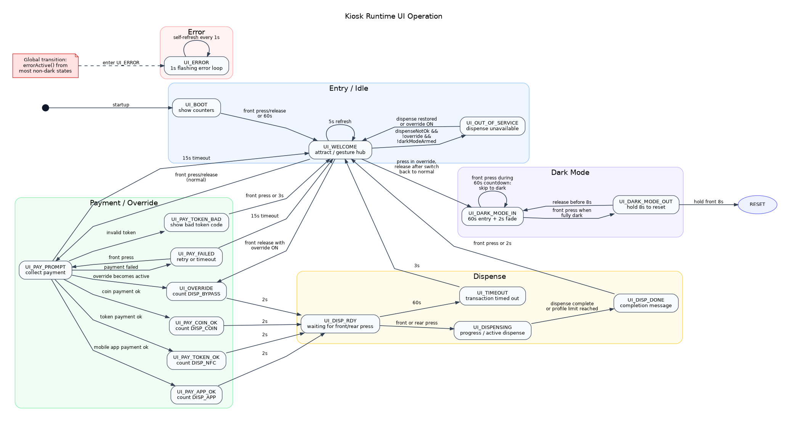
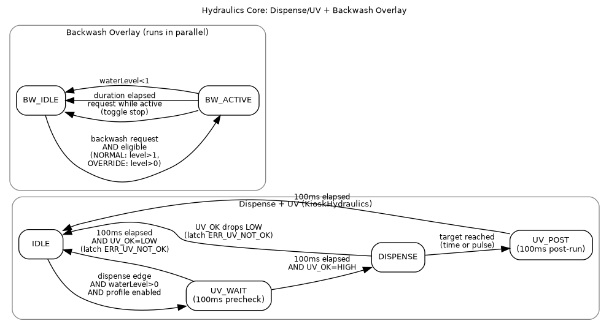
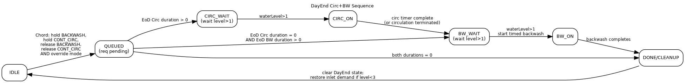
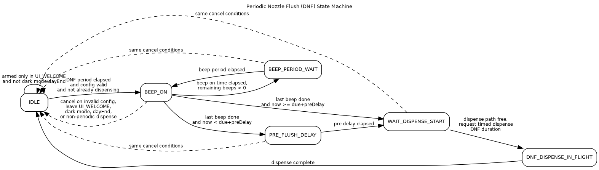

# Kiosk Software Operating Manual

## 1. Scope
This manual describes the runtime software behavior of the kiosk firmware in `Kiosk.ino` and its primary modules:

- `KioskBehavior.*`
- `KioskHydraulics.*`
- `KioskIO.*`
- `KioskEeprom.*` (runtime parameter reads/writes)

Explicitly excluded from this manual:

- EEPROM Editor mode (`KioskEepromEditor.*`)
- Sequential I/O Test mode (`KioskSeqTest.*`)

Those have separate dedicated manuals.

## 2. Runtime Architecture
The runtime loop is split into three control layers:

1. UI layer (`KioskBehavior::Ui`)
- Runs the LCD-facing customer state machine.
- Emits `requestDispensePulse` and LED/backlight intents.

2. Policy/orchestration layer (`KioskBehavior::updateHydraulics`)
- Resolves mode-specific rules and button choreography.
- Arbitrates SensorBypass, Backwash, WaterInlet, Tank circulation, DayEnd, and Periodic Nozzle Flush.

3. Actuator layer (`KioskHydraulics` + `KioskIO`)
- Executes dispense/UV/backwash low-level state machines.
- Drives physical outputs and inlet PWM kick/hold behavior.

## 3. Operating Modes
## 3.1 Normal Mode
- Payment is required before dispense.
- Front button drives payment and dispense flow via UI states.
- Rear hydraulic control buttons are still read by hydraulics policy.

## 3.2 Override Mode
- Front button bypasses payment path (goes directly to `UI_DISP_RDY`).
- Hydraulic control buttons can override/terminate conflicting functions (as defined below).

## 3.3 Dark Mode
- Enter from `UI_WELCOME` using the front-button gesture:
  press in Override, then release after the mode switch is moved to Normal.
- Entry phase (`UI_DARK_MODE_IN`) shows a 60s countdown; pressing front can truncate to immediate dark transition.
- In dark phase, LCD backlight and front LED are off; OLED row 14 shows `IN DARK MODE`.
- Exit phase (`UI_DARK_MODE_OUT`) requires holding front button for 15s.
- Releasing early during exit returns to dark-in state.
- Completing exit hold requests a reset.

## 4. Boot-Time Entry Points
At startup the firmware checks button chords:

1. Dispense calibration mode: `BTN_SINGLE_DISP` held at boot.
2. EEPROM editor chord (excluded from this manual).
3. Sequential test chord (excluded from this manual).

## 5. UI State Machine
The runtime UI state machine is shown below.

### 5.1 UI State Summary
| State | Purpose | Main exit conditions |
|---|---|---|
| `UI_BOOT` | Show counters on LCD | Front press/release or 60s timeout |
| `UI_WELCOME` | Idle welcome screen | Normal: to payment; Override: to `UI_OVERRIDE`; dark gesture; out-of-service |
| `UI_PAY_PROMPT` | Payment collection | Payment OK/failed/bad token, or 15s timeout |
| `UI_PAY_*_OK` | Payment success acknowledgements | 2s to `UI_DISP_RDY` |
| `UI_PAY_FAILED` | Payment failed notice | Front press retry or 15s timeout |
| `UI_PAY_TOKEN_BAD` | Unknown token notice | Front press or 3s timeout |
| `UI_DISP_RDY` | Waiting for dispense trigger | Front/rear dispense press, or 60s timeout |
| `UI_DISPENSING` | Active dispense progress | Dispense complete |
| `UI_DISP_DONE` | Dispense complete message | Front press or 2s timeout |
| `UI_TIMEOUT` | Transaction timeout message | 3s timeout |
| `UI_OUT_OF_SERVICE` | Not currently dispensable | Auto-return when dispensable again or override is enabled |
| `UI_DARK_MODE_IN` | Dark-mode entry and dark hold state | Front press in dark -> `UI_DARK_MODE_OUT` |
| `UI_DARK_MODE_OUT` | Dark-mode exit hold | 8s hold -> reset, or release -> `UI_DARK_MODE_IN` |
| `UI_ERROR` | Error state | Self-refresh loop until reset/recovery path |

## 6. Hydraulics Core State Machine
Low-level dispense, UV gating, and backwash execution are implemented in `KioskHydraulics`.

### 6.1 Dispense and UV Interlock
Dispense state flow:

1. `IDLE` -> `UV_WAIT` on dispense edge if:
- water level > 0
- selected dispense profile is enabled

2. `UV_WAIT` (100ms):
- If `UV_OK` is HIGH, transition to `DISPENSE`.
- If `UV_OK` is LOW, abort and latch `ERR_UV_NOT_OK`.

3. `DISPENSE`:
- UV remains enabled.
- If `UV_OK` goes LOW at any time, dispense aborts and `ERR_UV_NOT_OK` is latched.
- Completion is by selected mode:
  time target or pulse target.

4. `UV_POST` (100ms) after dispense completion:
- UV remains on for post-run delay.
- Then returns to `IDLE`.

### 6.2 Backwash Overlay
Backwash runs in parallel with dispense state:

- Start request while idle:
  - Normal: requires water level > 1
  - Override: requires water level > 0
- Request while active: toggles backwash OFF.
- Auto-stop on duration expiry or tank level < 1.

## 7. Hydraulics Orchestration Rules
`KioskBehavior::updateHydraulics()` handles policy and conflict resolution.

## 7.1 Water Level Semantics
- `0`: empty
- `1`: low
- `2`: mid
- `3`: full (FULL sensor active-low asserted)

## 7.2 Water Inlet Strategy
Inlet demand combines an auto latch and a manual latch:

1. Startup prime:
- On first update after boot, if level < 3, manual inlet demand is set ON.

2. Hysteresis latch:
- If level < 2 -> auto latch ON.
- If level > 2 -> auto latch OFF.
- At level == 2 -> hold previous auto latch state.

3. Hard safety:
- If level > 2, manual inlet demand is cleared.
- Physical inlet output is forced OFF.

4. Manual hold-off (`BTN_WATER_INLET`):
- If inlet demand is currently ON, press enters hold-off for up to 1 hour.
- If OFF/HOLD and level < 3, press sets manual inlet demand ON and clears hold.
- Hold auto-expires after 1 hour.

5. Override suppression cancel:
- In Override, inlet button press can terminate active SensorBypass and/or Backwash first.
- If that suppression was blocking inlet and level < 3, inlet demand is re-enabled immediately.

6. Final inlet ON condition:
- `(autoLatch OR manualLatch)` AND `!hold` AND `level < 3` AND `!backwashActive` AND `!sensorBypass`.

## 7.3 SensorBypass
- Manual toggle source: `BTN_SENSOR_BYPASS` release.
- Duration chosen by press length:
  - `<= 2s` -> `MAN Bypass Short` (100ms LSB)
  - `> 2s`  -> `MAN Bypass Long` (10s LSB)
- Auto expiry by timer.
- If periodic bypass is enabled, schedule is maintained and restartable from button interaction.

Interaction with Backwash:

- Normal mode:
  - If backwash active/starting, SensorBypass request is queued.
- Override mode:
  - If backwash active, button first stops backwash then applies bypass toggle.

## 7.4 Backwash
- Manual source: `BTN_BACKWASH_CTL` release.
- Manual duration chosen by press length:
  - `<= 2s` -> `BW MAN Short` (1s LSB)
  - `> 2s`  -> `BW MAN Long` (2min LSB)
- Second manual press while active stops backwash.
- Auto sources:
  - Daily RTC schedule (`BW Daily Time`, `BW Daily Duratn`)
  - Dispense-count trigger (`BW AutoAfter N`)

Daily trigger rules:

- RTC must be present.
- Only in the first 60 minutes after configured daily time.
- Daily duration must be non-zero.
- Not already run for the same calendar date.
- Requires normal backwash eligibility by mode and level.

Dispense-count trigger rules:

- On each completed dispense: increment `BW DispCount`.
- If `BW AutoAfter N == 0`: auto trigger disabled.
- If count reaches threshold:
  - reset count to 0
  - queue auto backwash request

Backwash completion also resets `BW DispCount` to 0.

## 7.5 Tank Circulation
Manual circulation is controlled by `BTN_CONT_CIRC`:

1. Press while inactive and level > 0:
- Start circulation immediately.
- Final timeout is resolved on button release.

2. Release:
- `<= 2s` press -> short duration profile (`ManCircDur Shrt`, minutes LSB).
- `> 2s` press  -> long duration profile (`ManCircDur Long`, 10-minute LSB).
- Effective timeout subtracts already-held press time.

3. Press while active:
- Immediately terminates circulation and resets active tracking.

Auto circulation:

- Enabled only when both `AutoCirc Duratn > 0` and `AutoCirc Period > 0`.
- Runs periodically at configured period for configured duration (only if level > 0).

Dispense interaction:

- Active dispense pauses circulation output and timer.
- Remaining circulation time is extended by paused duration.

## 7.6 DayEnd Circ+BW
DayEnd sequence is queueable only in Override mode using chord:

1. Hold `BTN_BACKWASH_CTL`
2. Hold `BTN_CONT_CIRC`
3. Release `BTN_BACKWASH_CTL`
4. Release `BTN_CONT_CIRC`

On queue/init:

- Existing circulation/backwash activity is terminated.
- Auto-backwash and pending backwash are cleared.
- Active dispense is aborted.
- Inlet demand is restored if level < 3.

Sequence:

1. Run EoD circulation (`EoD Circ Durat`, 15s LSB), start only when level > 1.
2. Then run EoD backwash (`EoD BW Durat`, 1s LSB), start only when level > 1.
3. On completion, DayEnd state clears and inlet demand is restored if level < 3.

## 7.7 Periodic Nozzle Flush (DNF)
DNF is a timed automatic dispense in `UI_WELCOME` context.

Enable conditions:

- `DNF Rept Period > 0`
- `DNF DispDurat > 0`
- `Beep ON Time > 0`
- `Beep Period > 0`
- `Beep Count > 0`
- Not in dark mode
- Not in DayEnd
- UI currently in `UI_WELCOME`

Behavior:

1. On entering `UI_WELCOME`, DNF timer and phase are reset/armed.
2. After repeat period elapses:
- Acoustic alert pulses run (`setAcousticAlert` on Ozone output).
- Optional pre-flush delay is applied.
3. DNF timed dispense starts when dispense path is free.
4. DNF dispense uses DNF-specific timed duration (not normal dispense profile).
5. On completion, DNF returns to idle and waits for next repeat period.

Cancellation:

- Leaving `UI_WELCOME`, entering dark mode/dayEnd, invalid config, or non-periodic dispense activity can cancel pending DNF phases.

## 8. Control Buttons
| Button | Normal mode | Override mode |
|---|---|---|
| Front Dispense | UI navigation + payment flow + dispense start in `UI_DISP_RDY` | UI navigation + direct dispense path (no payment) |
| `BTN_SINGLE_DISP` (rear single) | Acts as rear dispense trigger in `UI_DISP_RDY` | Same |
| `BTN_BACKWASH_CTL` | Request/stop backwash; respects level and SensorBypass hold-off | Can terminate SensorBypass and start backwash if eligible |
| `BTN_SENSOR_BYPASS` | Toggle bypass; held if backwash active | Can stop backwash first, then toggle bypass |
| `BTN_WATER_INLET` | Toggle inlet demand/1h hold-off | Same plus suppression-cancel override behavior |
| `BTN_CONT_CIRC` | Start/stop manual circulation with short/long durations | Same |
| `BTN_CONT_DISP` | Runtime hydraulics: not used as main control | Used in DispenseCAL mode workflow |

## 9. Displays
## 9.1 Customer LCD (16x4)
Primary content is driven by UI state machine:

- Welcome/payment/dispense progress/timeout/error messages.
- In `UI_DISPENSING`, row 3 updates at controlled rate (not full-screen redraw every loop).

## 9.2 Rear OLED (16 rows)
Key runtime rows:

- Row 0: mode/state header (`Kiosk Operations` or dark-state id text).
- Row 2-4: water level, backwash eligibility, dispense eligibility.
- Row 5: inlet PWM phase (`PH0/PH1/PH2`).
- Row 7: Backwash status (`OFF/AUT/ON/EoD`) + right-justified counter.
- Row 8: SenseByp status (`OFF/AUT/ON`) + counter.
- Row 9: WaterInp status (`OFF/AUT/ON`) + counter.
- Row 10: TankCirc status (`OFF/AUT/ON/EoD`) + counter.
- Row 11: Dispense status (`OFF/AUT/ON/DNF`) + counter.
- Row 13/14: Dark-mode and DayEnd centered overlays.
- Row 15: `NORM/OVRD` + RTC datetime `YYMMDDHHMM`.

## 10. Error Handling and Fail-Safe Behavior
Error codes:

- `100` = dispense profile unavailable
- `101` = UV not OK during dispense precheck or active dispense

When an error is active:

- Software latches are cleared.
- Backwash, SensorBypass, WaterInlet, Dispense, Circulation, and acoustic alert are forced OFF.
- UI transitions to `UI_ERROR` (except while already in dark states).

## 11. Runtime EEPROM Parameters Used by Operations
This section lists runtime parameters used by kiosk operation (not editor behavior):

| Feature | Parameters used at runtime |
|---|---|
| Dispense | `Disp Ctrl Mode`, `TimedDisp Dur`, `PulseDisp Count` |
| Backwash | `BW AutoDuration`, `BW AutoAfter N`, `BW MAN Short`, `BW MAN Long`, `BW Daily Time`, `BW Daily Duratn` |
| SensorBypass | `SensByp Duratn`, `SensByp Period`, `MAN Bypass Short`, `MAN Bypass Long` |
| Water inlet solenoid | Inlet solenoid `StartPWM`, `HoldPWM`, `SwDelaySec` |
| Tank circulation | `AutoCirc Duratn`, `AutoCirc Period`, `ManCircDur Shrt`, `ManCircDur Long` |
| DayEnd | `EoD Circ Durat`, `EoD BW Durat` |
| Periodic nozzle flush | `DNF Rept Period`, `DNF DispDurat`, `PreFlshBeepDely`, `Beep ON Time`, `Beep Period`, `Beep Count` |

## 12. Dispense Calibration Mode (Boot Chord)
This mode is entered by holding `BTN_SINGLE_DISP` at boot.

Purpose:
- Measure manual dispense samples from the front button.
- Build an average sample duration.
- Save average duration to EEPROM measured dispense duration field.

Workflow:

1. Press and hold front dispense to start sample flow.
2. Release front button to stop sample and enter review.
3. In review:
- Short release on front: reject sample.
- Long release on front: accept sample into aggregate.
4. Long press on `BTN_CONT_DISP` or `BTN_SINGLE_DISP`:
- Save aggregate average to EEPROM.
- Trigger watchdog reset.

UI details:

- LCD row 3 shows sample count (`N=`) left-aligned and average (`AVG=`) right-aligned.
- Long-press threshold crossing blinks LCD backlight for 50ms.

## 13. Software/Hardware Notes
- Target platform: Arduino Mega 2560 (`arduino:avr:mega`).
- Water inlet PWM is two-phase: kick then hold (`PH1 -> PH2`).
- Acoustic alert output is mapped to Ozone output pin.
- `UV_OK` runtime logic is active-high (`HIGH` means UV ready/healthy).
