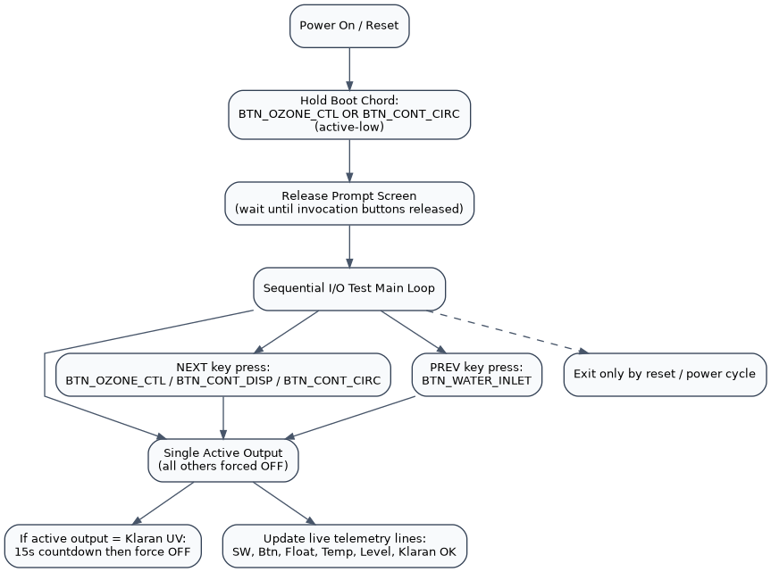
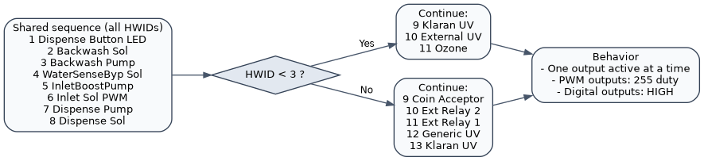

# Sequential I/O Test User Manual

## 1. Purpose

The Sequential I/O Test is a boot-time service mode used to verify:

- Output channels (solenoids, pumps, relays, LEDs, UV/Ozone paths).
- Key digital inputs and switch states.
- Temperature sensor readings.
- Water-level and Klaran UV-OK feedback.

This mode is intended for bench/service diagnostics, not normal kiosk operation.

---

## 2. Entry And Exit

## 2.1 Entering Sequential I/O Test

At power-up, hold either of these buttons:

- `BTN_OZONE_CTL`, or
- `BTN_CONT_CIRC`

When the release prompt appears, release the invocation button(s).

## 2.2 Exiting Sequential I/O Test

Sequential test mode is non-returning and runs continuously.

To exit:

- Reset/power-cycle the controller.

---

## 3. Mode Flow Diagram

---

## 4. Screen Behavior

## 3.1 OLED (primary live diagnostics)

- Row 0: `I/O SeqTest Mode`
- Row 1: separator
- Rows 2-4: instruction text
- Row 6: active output name (and Klaran timeout countdown when applicable)
- Rows 8-13: live input/status summary lines

## 3.2 LCD (operator header)

- Line 0: `I/O SeqTest Mode`
- Line 1: separator
- During release prompt: HWID/SWID are shown.

---

## 5. Controls During Test

The test cycles one output at a time.

- Next output: press any of
  - `BTN_OZONE_CTL`
  - `BTN_CONT_DISP`
  - `BTN_CONT_CIRC`
- Previous output: press
  - `BTN_WATER_INLET`

Navigation behavior:

- If no output is active, first “next” starts at index 0.
- If no output is active, “previous” starts at the last output.
- Exactly one output is active at a time.

---

## 6. Output Test Sequence

The sequence depends on HWID.

Shared sequence (all HWIDs):

1. Dispense Button LED (`PWM_DISP_BTTN_LED`)
2. Backwash Solenoid (`PWM_BACKWASH_SOL`)
3. Backwash Pump (`OUT_BACKWASH_PUMP`)
4. Water Sensor Bypass Solenoid (`PWM_SENSOR_BYP_SOL`)
5. Inlet Boost Pump (`OUT_INLET_BOOST_PUMP`)
6. Inlet Solenoid PWM (`PWM_INLET_SOL`)
7. Dispense Pump (`OUT_WATERDISP_PUMP`)
8. Dispense Solenoid (`PWM_WATERDISP_SOL`)

If `HWID < 3`:

9. Klaran UV (`OUT_KLARAN_UV`)
10. External UV (`OUT_EXT_UV`)
11. Ozone (`OUT_OZONE`)

If `HWID >= 3`:

9. Coin Acceptor (`OUT_COIN_ACCEPTOR`)
10. External Relay 2 (`OUT_EXT_RELAY_2`)
11. External Relay 1 (`OUT_EXT_RELAY_1`)
12. Generic UV (`OUT_EXT_UV`)
13. Klaran UV (`OUT_KLARAN_UV`)

Notes:

- PWM channels are driven at full duty while active.
- Non-PWM outputs are driven HIGH while active.
- All non-active outputs are forced OFF.

---

## 7. Output Sequence Diagram

---

## 8. Klaran UV Special Handling

When the active output is Klaran UV:

- A 15-second safety timer starts.
- OLED row 6 shows remaining seconds.
- After timeout, Klaran UV output is forced OFF automatically.

Klaran status line (`Klaran OK`) behavior:

- `N/A` when Klaran UV is not currently under active timed check.
- `OK` when `IN_KLARAN_UV_OK` input is HIGH during active Klaran window.
- `NO` when the input is not asserted during active Klaran window.

---

## 9. Live Input/Status Lines (OLED Rows 8-13)

- `SW: 1=... 2=...`
  - SW1 uses `OVERRIDE_SWITCH`
  - SW2 uses `IN_SW_2`
- `Btn: 1=... 2=...`
  - Button 1 uses `BTN_FRONT_DISPENSE`
  - Button 2 uses `BTN_SPARE_BUTTON`
- `FloatSW: Active/Inactive`
  - Uses `IN_WATER_LEVEL_FULL` (active-low)
- `Temp 1:xxx 2:yyy`
  - From one-wire sensors on `IN_TEMP_T1` and `IN_TEMP_T2`
  - Updates approximately once per second
  - Invalid reads shown as `--`
- `Level: L=.. M=..`
  - Raw state of `IN_WATER_LEVEL_LOW` and `IN_WATER_LEVEL_MED`
- `Klaran OK: ...`
  - As described in Section 6

---

## 10. Typical Test Procedure

1. Enter Sequential I/O Test at boot.
2. Confirm release prompt and enter main screen.
3. Use “next output” buttons to step through every output.
4. For each step:
   - Verify expected actuator energizes.
   - Verify all others are off.
5. Observe rows 8-13 for switch/input telemetry.
6. For Klaran UV step:
   - Confirm 15-second countdown appears.
   - Verify auto shutoff at timeout.
   - Verify `Klaran OK` response.
7. Reset/power-cycle to leave test mode.

---

## 11. Troubleshooting

- No mode entry at boot:
  - Re-check button hold timing and wiring for `BTN_OZONE_CTL` / `BTN_CONT_CIRC`.
- Cannot step outputs:
  - Verify button inputs for `BTN_OZONE_CTL`, `BTN_CONT_DISP`, `BTN_CONT_CIRC`, `BTN_WATER_INLET`.
- Wrong output activates:
  - Confirm board HWID; sequence differs for `<3` vs `>=3`.
- Temperature shows `--`:
  - Check one-wire sensors and bus wiring.
- Klaran never shows `OK`:
  - Check `IN_KLARAN_UV_OK` signal path and sensor logic.

---

## 12. Safety Notes

- This mode directly energizes pumps/solenoids/relays one-by-one.
- Use appropriate safe hydraulic/electrical test conditions.
- Keep downstream loads safe before activating high-power outputs.
