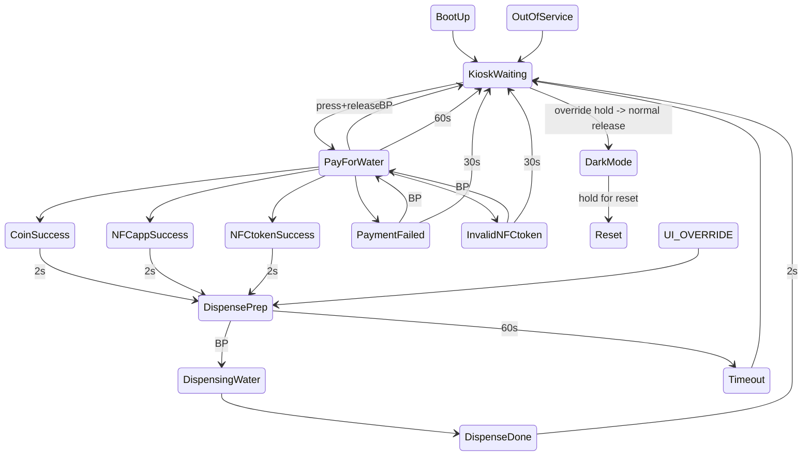

# Majicom Kiosk System Operation

## 1) Purpose and scope
Define the functional operation of the embedded control system for the Majicom Kiosk.
This document serves as the framework for Codex implementation and the functional
definition for product owners.

## 1a) Build requirements
- Builds must refresh the `ver:YYMMDDHHMMSS` timestamp in any module being built.
- When running via Codex, build and upload must be executed with unsandboxed device access.

## 2) System overview
Embedded control for the Majicom Water Kiosk connected to a water supply. The kiosk
has an external customer UI at the front (button with configurable LED surround) used
to pay for and dispense water. A keyswitch allows an operator to configure the kiosk
into Normal or Override Mode. An internal operator UI is accessible via the rear hatch
and consists of an OLED, 7 buttons, and reset; it is used to test, adapt, modify, and
update kiosk operation.

## 3) Operating modes
Primary operating modes:
- Normal Mode: Standard operation requiring payment.
- Override Mode: Same as Normal but without payment requirement.

Normal Mode, from boot:
- Hydraulic system starts as normal.
- LCD shows current (obtained from EEPROM) water purchase numbers until timeout or Front Dispense button press.
- OLED always uses the last 4 lines to show the same water purchase numbers.
- OLED shows "Normal Mode" and "----------------" on the top 2 lines.
- Rear-accessible buttons do not function (except RESET which always works).
- While waiting, the system checks that the UV system is OK.
- Waits for purchase via AppNFC, TokenNFC, or coins.
- Dispenses water.
- Repeats until end-of-day change of mode to Override or shutdown.

Override Mode:
- Same as Normal Mode but without any payment requirement.
- Pressing the Front Dispense Button dispenses water if permitted.
- OLED shows "Override Mode" and "----------------" on the top 2 lines.
- Rear-accessible buttons perform their normal toggle functions as permitted by the
  hydraulic system.

Special boot cases (only when booting in Override Mode):
- If BTN_OZONE_CTL is held down: OutputTestMode.
  - LCD and OLED show "Output Test Mode" and "----------------" on top 2 lines.
  - LCD shows "System" and "Maintenance" on lines 2 and 3.
  - Each press of BTN_OZONE_CTL activates outputs in sequence:
    BACKWASH_SOLENOID
    BACKWASH_PUMP
    SENSOR_BYPASS_SOLENOID
    WATER_INLET_PUMP
    WATER_INLET_SOLENOID
    WATER_DISP_PUMP
    WATER_RECIRC_SOLENOID
    KLARAN_UV (on for a maximum of 5s)
    GENERIC_UV
    OZONE_GEN
    Repeat sequence.
  - Pressing the Front Dispense Button toggles the button LED ON/OFF on each press.
- If BACKWASH_TOGGLE and SENSOR_BYPASS buttons are held down: EEPROMeditorMode.
  - EEPROM editor must remain a boot-chord-only feature (no runtime entry).
  - Functionality is demonstrated in a TBC EEPROMeditor.ini sketch.
- If WATER_INLET_TOGGLE button is held down: FunctionCheckMode.
  - LCD and OLED show "Funct Check Mode" and "================" on top 2 lines.
  - Functionality is demonstrated in a TBC .ini sketch.

If any of these last three cases are requested without Override Mode, the system
stops until no buttons are held down, then reboots.

## 4) State machine
Hydraulic functionality and interactions are addressed in the operational module.
The UI state machine is defined in
`ExtraDocs/Majicom Kiosk UI Statemachine v1.6.htm` and the extracted table in
`ExtraDocs/Majicom_Kiosk_UI_Statemachine_v1.6_extracted_table.txt`.
The `.docx` table is authoritative for transitions and notes; LCD text strings are
captured in the extracted table where the `.docx` table leaves the LCD Text cell blank.

UI states and transitions (current firmware naming):
- UI_BOOT (BootUp): waiting mode. LED heartbeat pulse repeats every 2s. LCD BL flicks every 2s.
  Displays for 30s or until BTN_FRONT_DISP is pressed. 30s/BP->UI_WELCOME.
  LCD text (MS Word newlines):
  ```text
  App Sales :nnnnn
  Coin Sales:nnnnn
  NFC Tag :nnnnn
  Bypass :nnnnn (repeated on LCD)
  ```
- UI_WELCOME (KioskWaiting): "Majicom Welcome!" + "Press button to start" + "20p/500ml".
  Waiting state. LED heartbeat pulse repeats every 2s. LCD BL flicks every 2s.
  UVsystemCheck on exit. ErrCode=10. BP->UI_PAY_PROMPT.
  LCD text (MS Word newlines):
  ```text
  Majicom Welcome!
  ================
  Press button to
  start 20p/500ml (repeated on LCD)
  ```
- UI_PAY_PROMPT (PayForWater): For kiosks with (a) both coin acceptors and NFC interfaces or
  (b) only the NFC interface. Button pressed. Reverts to UI_WELCOME if button is pressed
  again or no payment within 60s. `KIOSK_COIN_ACC` determines which screen displays.
  UI_PAY_*; BP->UI_WELCOME; 60s->UI_WELCOME. LED SOLID_ON. In Override Mode, this
  state is silent and passed through.
  LCD text (MS Word newlines):
  ```text
  Buy with coins or the Majicom mobile app
  price: 20p/500ml (variant text depends on KIOSK_COIN_ACC)
  ```
- UI_PAY_COIN_OK (CoinSuccess): LCD backlight FLICKs OFF for 100ms on intro. 2s->UI_DISP_RDY.
  LCD text (MS Word newlines):
  ```text
  Thanks!
  Your coin payment has been processed (repeated on LCD)
  ```
- UI_PAY_APP_OK (NFCappSuccess): LCD backlight FLICKs OFF for 100ms. 2s->UI_DISP_RDY.
  LCD text (MS Word newlines):
  ```text
  Thanks!
  Your NFC credit payment has been processed. (repeated on LCD)
  ```
- UI_PAY_TOKEN_OK (NFCtokenSuccess): LCD backlight FLICKs OFF for 100ms. 2s->UI_DISP_RDY.
  Button LED OFF.
  LCD text (MS Word newlines):
  ```text
  Thanks!
  Your NFC token payment has been processed. (repeated on LCD)
  ```
- UI_OVERRIDE (OverrideSuccess): Override success state, passes to UI_DISP_RDY.
- UI_DISP_RDY (DispensePrep): Payment made, waiting to start dispensing. Flash rate.
  BP->UI_DISPENSING; 60s->UI_TIMEOUT (after timeout).
  LCD text (MS Word newlines):
  ```text
  Place your container under the spout and press the button (repeated on LCD)
  ```
- UI_DISPENSING (DispensingWater): LCD backlight solid while dispensing with progress bar and
  percentage. Button LED flashes more quickly as water is dispensed, fully on when
  dispense is complete. 1 Hz at 0% through to 10 Hz at 100%.
  LCD text (MS Word newlines):
  ```text
  Dispensing clean pure water...
  ##########_37% (repeated on LCD)
  ```
- UI_DISP_DONE (DispenseDone): Hold for 3s, flick and exit. Call KIOSK_CHECK_WATER on exit;
  sets `KIOSK_WATER_LEVEL=0` if water level is below L. 2s->UI_WELCOME.
  LCD text (MS Word newlines):
  ```text
  Dispensing done!
  Thankyou.
  Please come back again soon! (repeated on LCD)
  ```
- UI_PAY_FAILED (PaymentFailed): Hold for button press (retry payment) or timeout (go to start/wait).
  BP->UI_PAY_PROMPT; 30s->UI_WELCOME.
  LCD text (MS Word newlines):
  ```text
  Payment failed!
  Press button to
  attempt payment
  again. (repeated on LCD)
  ```
- UI_PAY_TOKEN_BAD (InvalidNFCtoken): Unrecognised token is refused and the token hash is printed
  onscreen as Code:xxxxxxxx. BP->UI_PAY_PROMPT; 30s->UI_WELCOME.
  LCD text (MS Word newlines):
  ```text
  Invalid Token!
  Not accepted on this Kiosk.
  Code:F37DAC66 (repeated on LCD)
  ```
- UI_DARK_MODE (DarkMode): Entered only from UI_WELCOME using the override-hold gesture.
  LCD shows a long-delay countdown, then prints DARK/MODE briefly, then turns off backlight and
  the front button LED. Hold the front button for a medium delay to reset.
- UI_TIMEOUT: Transaction timed out. Short delay before returning to UI_WELCOME.
- UI_OUT_OF_SERVICE: Kiosk not dispensing; returns to UI_WELCOME when service is restored.

UI ancillaries and modes:
- LCD backlight modes: ON, OFF, FLICK on INTRO, FLICK on EXIT (OFF duration ~100 ms).
  - FLICK on INTRO: disable BL, start timer, send new LCD text, enable BL on timeout.
  - FLICK on EXIT: disable BL, start timer, return to state machine.
- Button LED modes: OFF, SOLID_ON, PULSE_ON, FLASH_ON, VARI_RATE_FLASH.
  - PULSE_ON: double sinusoidal heartbeat pulse; each beat 0.5s; double takes 1s.
  - FLASH_ON: symmetric ON/OFF flash (typically 2 Hz), configurable 1-10 Hz via
    `KIOSK_BUTTON_FLASHE_RATE`.

UI state flow (from State Name + Next State columns):


### 4a) Hydraulic interaction model (authoritative)
The hydraulic control logic is event-driven around three async operator events:
- `SENSOR_BYPASS` from `BTN_SENSOR_BYPASS`
- `BACKWASH_CTL` from `BTN_BACKWASH_CTL`
- `WATER_INLET` from `BTN_WATER_INLET`

`SensorBypass`:
- Pauses WaterInlet while active; WaterInlet resumes from its prior demand state when bypass clears.
- If Backwash is active, SensorBypass toggle is held off.
- In Override Mode, if source is `BTN_SENSOR_BYPASS` and Backwash is active, Backwash is terminated first.
- Pressing `BTN_SENSOR_BYPASS` while SensorBypass is active terminates SensorBypass (toggle-off).

`Backwash`:
- Pauses WaterInlet while active; WaterInlet resumes from its prior demand state when backwash clears.
- If SensorBypass is active, Backwash is held off.
- Normal Mode eligibility: `waterLevel > 1`.
- Override Mode eligibility: `waterLevel > 0`.
- In Override Mode, if source is `BTN_BACKWASH_CTL` and SensorBypass is active, SensorBypass is terminated first.
- Pressing `BTN_BACKWASH_CTL` while Backwash is active terminates Backwash (toggle-off).

`WaterInlet`:
- Holds off whenever SensorBypass and/or Backwash is active.
- Inlet level hysteresis (all modes):
  - turns ON when `waterLevel < 2`
  - stays ON until `waterLevel > 2`, then turns OFF
  - stays OFF until `waterLevel < 2`, then turns ON
- In Override Mode, if source is `BTN_WATER_INLET`, active SensorBypass and/or Backwash are terminated.
- Pressing `BTN_WATER_INLET` while WaterInlet is active forces temporary inlet hold-off until:
  - a water-level change occurs below FULL (`< 3`), or
  - Backwash completes, or
  - SensorBypass completes.

## 5) Inputs/outputs
Inputs and outputs are defined in `KioskIOpins.h` for reference only. The values
in `KioskIOpins.h` must never be used directly unless creating a setter/getter
or pin manipulation function in `KioskIO.h`. All pin I/O must be accessed via
the setters/getters in `KioskIO.h`; direct pin addressing is not permitted.
Summary (buttons and key actuators) with name mapping for Codex reference:
- Button inputs: `FRONT_DISPENSE`, `BACKWASH_CTL`, `SENSOR_BYPASS`, `CONT_CIRC`, `WATER_INLET`, `CONT_DISP`, `SINGLE_DISP`, `OZONE_CTL`.
- Switch inputs: `OVERRIDE_SWITCH`.
- Payment inputs: `COIN_PULSE`, `COIN_ACCEPT`, `PN532_IRQ`.
- Flow/dispense inputs: `DISP_FLOW_PULSE`, `INLET_FLOW_PULSE`.
- Water level inputs: `WATER_LEVEL_LOW`, `WATER_LEVEL_MED`, `WATER_LEVEL_FULL`.
- System status inputs: `KLARAN_UV_OK`, `DFP_BUSY`, `HUMAN_PRESENCE`.
- Temperature inputs: `TEMP_T1`, `TEMP_T2`.
- Analog sensor inputs: `TURBIDITY`, `PH`, `SPARE1`, `SPARE2`.
- Solenoid PWM outputs: `BACKWASH_SOL`, `SENSOR_BYP_SOL`, `INLET_SOL`, `WATERDISP_SOL`.
- Motor/pump outputs: `BACKWASH_PUMP`, `INLET_BOOST_PUMP`, `WATERDISP_PUMP`.
- UV outputs: `KLARAN_UV`, `EXT_UV`.
- LED PWM output: `DISP_BTTN_LED` (Front Button LED Ring).

## 6) Safety rules and constraints
To be addressed in detail in the operational module.

## 7) Timing requirements
Classic foreground-loop embedded system with loop delays kept to a minimum. The NFC
subsystem blocks for ~800 ms; time-critical aspects (for example, button responses)
are addressed using interrupts.

## 8) Error handling
Error messages are printed on the serial monitor.

## 9) Logging/telemetry
None at this point. Serial debug output TBC.

## 10) Acceptance criteria
Embedded software and controller hardware must meet the criteria outlined in this
document. Each system will be tested on its own before integration.
